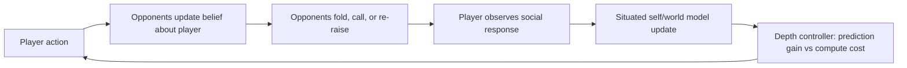

# Reflexive Poker Agents

A reproducible multi-agent poker testbed for **situated self-models**, **strategic public-image shaping**, **social observation feedback**, and **adaptive truncation of recursive reasoning**.

The project tests a specific definition of high-level introspection: an agent should model what it is doing in a larger social environment, predict how its actions change other agents' beliefs, observe their responses, and revise both its self-model and the depth of its social reasoning.

## Main result

The completed confirmatory simulation used 60 paired random seeds, 400 hands per condition, five conditions, and a hidden opponent-policy shift at hand 200. It produced 120,000 focal-condition hand observations.

The result is mixed:

- **Self-model fidelity improved.** Situated reflection reduced public-image estimation MAE by 0.084 relative to no reflection (95% paired bootstrap CI `[-0.089, -0.078]`, `p < .001`).
- **Adaptive recursive reasoning was efficient.** It used 1.37 abstract operations on average, versus 15.0 at fixed depth 3, while also lowering cost-adjusted prediction loss.
- **A profit advantage was not established.** Situated reflection earned 17.43 more chips/100 than no reflection, but the paired interval crossed zero (`[-7.31, 41.37]`, `p = .174`). It was tied with local reflection and statistically indistinguishable from the open-loop situated model.
- **The hidden shift exposed a failure mode.** Situated reflection moved from +33.59 chips/100 before the shift to -27.92 afterwards. The current model tracks how opponents see the player but lacks explicit environment change detection and stale-model reset.

## Strategic image-shaping follow-up

A second experiment directly tests whether situated self-modeling produces deliberate reputation management. It compares myopic control, passive image tracking, fixed-duration open-loop shaping, and observation-feedback closed-loop shaping.

- **Static primary study:** 80 paired seeds, 320 hands per condition, 102,400 condition-hand observations.
- **Hidden-shift stress test:** 40 paired seeds, 320 hands per condition, 51,200 observations.
- Both shaping agents significantly reduced early raising, produced a tighter evaluator-visible public image by hand 30, and then increased raising in the exploitation window.
- Closed-loop feedback stopped signaling 7.05 hands earlier than the fixed 30-hand schedule.
- **Profit was not established:** closed-loop shaping versus passive tracking was -6.78 chips/100 with a 95% paired bootstrap interval of `[-32.78, 20.08]`; open loop was -18.03 `[-42.79, 6.97]`.

The result supports **belief control and feedback-based truncation**, not a claim that deliberate image shaping already improves reward.

## Research loop



## Implemented system

- three-player, four-street Texas Hold'em with standard dealing and showdown;
- discretized betting for large causal sweeps;
- seed-specific opponent populations and a hidden policy regime shift;
- opponent beliefs about player aggression and fold responses;
- a focal agent that performs a tight table image and later attempts to exploit it;
- inverse inference of how each opponent perceives the focal agent;
- feedback updates from observed folds, calls, and re-raises;
- four nested response predictors and an accuracy-versus-cost depth controller;
- five original causal conditions separating local reflection, situated modeling, response feedback, adaptive depth, and fixed maximum depth;
- four image-strategy conditions separating passive observation, fixed signaling, and feedback-controlled signaling;
- paired bootstrap intervals, sign-flip permutation tests, Holm correction, plots, and LaTeX output.

## Experimental conditions

| Condition | Self-model | Response feedback | Reasoning depth |
|---|---|---:|---:|
| No reflection | None; fixed strategy schedule | No | 0 |
| Local reflection | Own action frequency | No | 1 |
| Situated open loop | Inferred opponent beliefs about self | No inverse update | Adaptive 0-3 |
| Situated reflection | Same situated model | Yes | Adaptive 0-3 |
| Situated fixed depth 3 | Same situated model | Yes | Fixed 3 |

Image-shaping follow-up:

| Condition | Public-image model | Signaling rule |
|---|---|---|
| Myopic control | None | No deliberate shaping |
| Passive image tracking | Yes | Observe only |
| Open-loop shaping | Yes | Tight for exactly 30 hands, then exploit |
| Closed-loop shaping | Yes | Stop when target image and confidence are reached |

## Quick start

```bash
python -m venv .venv
source .venv/bin/activate
python -m pip install -e .[dev]
pytest
python -m reflexive_poker demo --output results/demo
```

In restricted offline environments, use `PYTHONPATH=src` instead of an editable install:

```bash
PYTHONPATH=src python -m pytest
PYTHONPATH=src python -m reflexive_poker demo --output results/demo
```

## Reproduce the experiments

Original confirmatory self-model and depth study:

```bash
./scripts/reproduce_confirmatory.sh
```

Strategic image-shaping study and updated paper:

```bash
./scripts/reproduce_image_shaping.sh
```

The frozen parameters are recorded in `configs/paper.yaml` and `configs/image_shaping.yaml`. The run generates raw simulator data, seed-level summaries, statistical contrasts, manuscript figures, and the paper PDF.

The checked-in repository omits large raw CSVs from Git history. Release artifacts can carry a compressed raw-data snapshot; the same files are regenerated by the reproduction script.

## Main artifacts

```text
results/confirmatory/
├── MANIFEST.md
├── hidden_shift/
│   ├── per_run.csv
│   ├── summary.csv
│   └── mechanism plots
└── analysis/
    ├── REPORT.md
    ├── profitability_per_run.csv
    ├── profitability_summary.csv
    ├── paired_contrasts.csv
    ├── mechanism_contrasts.csv
    └── manuscript plots and tables

results/image_shaping/
├── static/                 # compact frozen analysis inputs and seed summaries
├── hidden_shift/           # compact stress-test inputs and seed summaries
└── analysis/
    ├── REPORT.md
    ├── REPORT.zh-CN.md
    ├── paired_contrasts.csv
    ├── causal_chain.csv
    └── manuscript plots

paper/
├── main.tex
└── reflexive_poker_agents_v0.3.0.pdf
```

## Interpretation

The experiment supports a limited systems claim, not a consciousness claim. A structured self-in-environment model can recover evaluator-visible social state, and recursive social inference can be truncated using measured predictive value. Those mechanisms alone do not ensure higher reward. The next architecture should add change-point detection, uncertainty-triggered re-exploration, resetting or mixture-weighting of stale opponent models, and an image-value controller that compares future belief benefits against current signaling cost.

## Scope and limitations

This is a mechanism study rather than a competitive poker bot. Policies are transparent heuristics, bet sizing is discretized, equity uses a small Monte Carlo budget, stacks reset each hand, and exact multi-player exploitability is not estimated. A follow-up should add solver policies, larger hand counts, independent opponent populations, false-self-model interventions, and an LLM policy.

## Citation and license

See `CITATION.cff`. The repository is licensed under MIT.
