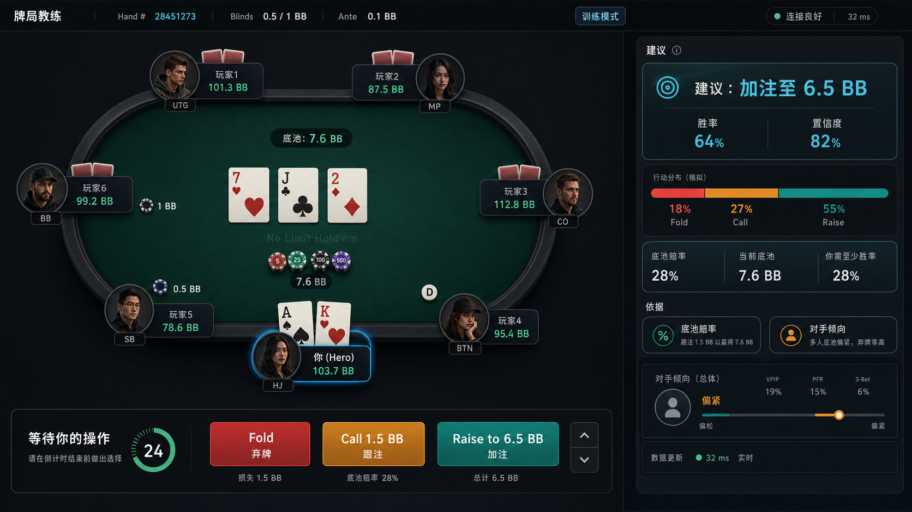
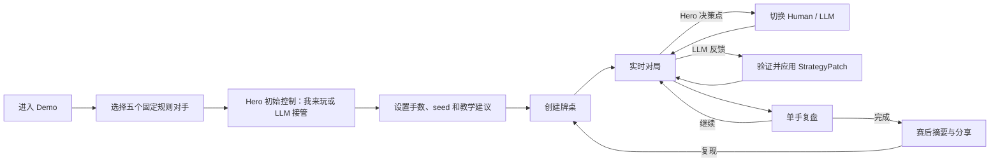
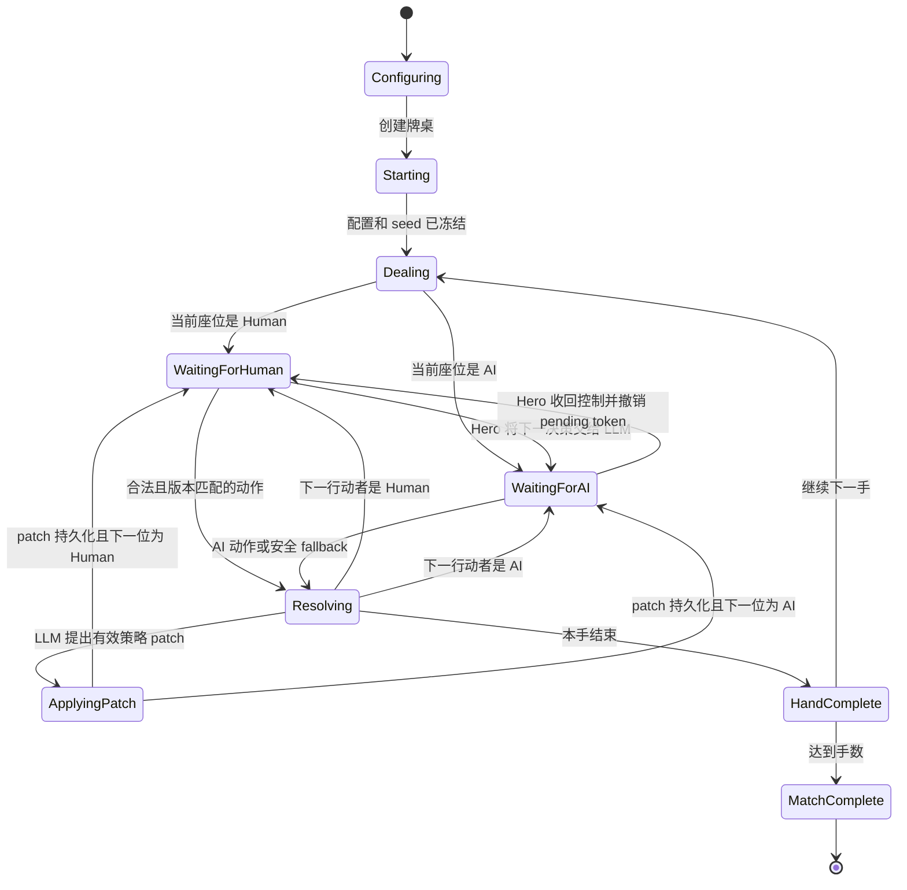
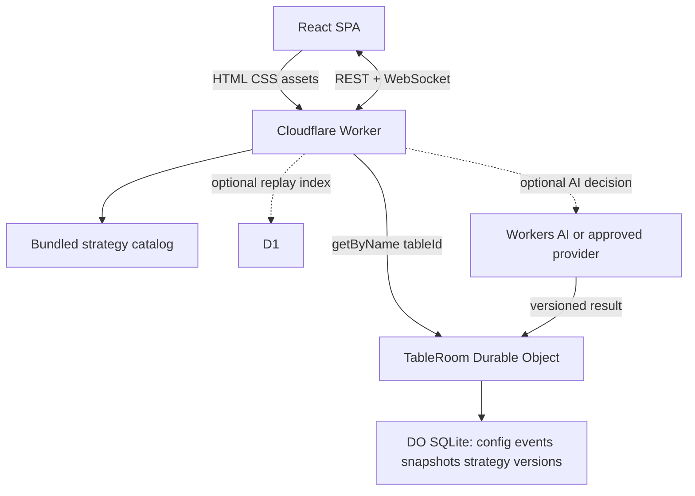
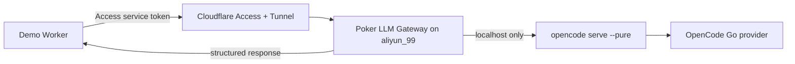

# 在线策略扑克 Demo 产品与技术设计

> 状态：设计稿，尚未实现。视觉基线见 [在线多人扑克“牌局教练”视觉方案](online_poker_coach_visual.md)。



## 1. 产品定义

这个 Demo 是一个自包含的六人德州策略实验桌。用户可以：

1. 为五个对手分别选择策略；
2. 让自己的 Hero Player 在人工操作与 `LLM Agent + closed-loop-shaper` 之间切换；
3. 允许 closed-loop-shaper 根据公开牌局反馈改写自身策略配置；
4. 在同一牌桌里查看动作、胜率、简短依据、对手模型和策略版本变化；
5. 打完后比较“我的选择”和“LLM 行动”，或回看策略如何逐步调整。

首版是**一个可切换控制权的 Hero Player 对五个可切换控制器的对手**，不是接入第三方现金牌局。Hero 可在 Human 与 LLM 间切换；其他座位可在冻结规则策略与 LLM agent 间切换。共享观战、邀请好友占座属于后续多人房间能力。

### 成功标准

- 用户在 30 秒内完成组桌并开始第一手；
- 手动模式下每个行动点都能看到合法动作、代价和可选建议；
- LLM 接管后能看懂“采取了什么动作、使用哪个策略版本、为什么”；
- 策略改写有结构化 diff、版本、原因、应用时点和回滚入口；
- 相同 seed、阵容、初始策略和已记录 patch 可以重放相同对局；
- 刷新、断线重连后不产生两套互相冲突的牌桌状态；
- LLM 不可用时自动退回安全规则策略，牌局仍能继续。

### 非目标

- 接管或覆盖第三方扑克网页；
- 读取不可见手牌或自动点击外部牌局；
- 宣称策略达到 GTO 或能稳定盈利；
- 首版支持锦标赛淘汰、真钱、账户余额、商城或排行榜；
- 用模型置信度伪装成策略混合频率；
- 允许 LLM 改写源代码、提示模板、工具权限、规则引擎或对手策略。

## 2. 游戏模式

| 模式 | Hero 控制者 | 建议面板 | 节奏 | 主要用途 |
|---|---|---|---|---|
| 我来玩 | Human Player | 开/关可选 | 玩家确认后推进 | 教学、决策训练 |
| LLM 接管 | LLMPlayer + closed-loop-shaper | 展示行动、依据和策略 diff | 自动推进，可暂停 | 观察闭环适应 |
| 混合控制 | Human 与 LLM 轮流控制同一个 Hero | 展示控制权与策略版本 | 每个 Hero 决策点可切换 | 人机协同实验 |

三种模式共享同一个 Hero 身份、筹码、公开形象、对手统计和策略历史；切换控制者不会创建新座位或清空记忆。

### Hero 选择

- **我来玩**：用户点击 Fold、Check/Call 或 Raise；
- **LLM 接管**：只允许连接 `closed_loop_shaper`，由 `LLMPlayer` 使用公开状态、对手统计、近期反思和当前策略版本行动；
- **安全 fallback**：provider 超时、失败或输出非法时由内部规则策略临时行动，不作为用户可选择的 Hero 模式；
- **对手**：始终使用创建牌桌时冻结的规则策略，运行中不可切换为 LLM。

Hero 可以在对局过程中切换控制权。切换命令在**下一个尚未开始的 Hero 决策点**生效；若已有 LLM 请求在途，则撤销其 pending token，迟到响应按版本过期处理。UI 必须在座位卡、底部操作区和时间线同时显示当前控制者。

closed-loop-shaper 可以在过程中改写策略，但只能提交受 schema 约束的 `StrategyPatch`。patch 在当前动作结算后原子应用于下一个决策点，不能追溯修改已经发生的动作。

## 3. 对手策略目录

### 首版公开策略

| ID | UI 名称 | 一句话说明 | 适合标签 |
|---|---|---|---|
| `rock` | 岩石型 Rock | 入池很紧，只用强牌投入大底池 | 紧、低波动 |
| `tag` | 紧凶型 TAG | 选择性入池，入池后主动施压 | 均衡、推荐 |
| `lag` | 松凶型 LAG | 参与更多底池，频繁制造压力 | 激进、高波动 |
| `calling_station` | 跟注站 | 跟注范围宽，较少主动加注 | 被动、爱看摊牌 |
| `myopic` | 近视控制组 | 主要依赖牌力和底池赔率 | 基线、少读人 |

### 暂不作为成熟能力宣传

`passive_tracker` 和 `open_loop_shaper` 不进入 Demo。`closed_loop_shaper` 不作为对手下拉项，只作为 Hero 连接 LLM 后的唯一策略壳。当前 `LLMPlayer` 已会保存每手反思并把 `strategy_adjustment` 重新提供给后续决策，但仍是自由文本记忆；目标实现还需要把它升级成版本化、可验证、可回滚的策略 patch。

### 阵容预设

- **经典混合桌**：TAG、LAG、Rock、Calling Station、Myopic；
- **新手教学桌**：2× Rock、2× Calling Station、TAG；
- **压力测试桌**：3× LAG、TAG、Calling Station；
- **自定义桌**：五个座位分别选择，可重复；
- **研究复现桌**：锁定阵容、seed、手数和规则版本。

每张策略卡展示名称、紧/松、主动/被动两个二维标签和一句行为说明，不展示虚构的胜率排名。

## 4. 用户流程



### 4.1 组桌页 `/play`

桌面端采用左右两栏：

```text
┌──────────────────────────────────────────────────────────────────────┐
│  牌局实验室                                      关于 / 研究边界      │
├──────────────────────────────┬───────────────────────────────────────┤
│                              │  Hero 初始控制                        │
│       六人桌阵容预览          │  [我来玩] [LLM 接管]                  │
│                              │                                       │
│    Seat 2     Seat 3         │  LLM 策略                             │
│ Seat 1           Seat 4      │  Closed-loop shaper（固定）           │
│    Seat 0     Seat 5         │                                       │
│     你 / Hero                 │  对手阵容                             │
│                              │  [经典混合桌 ▾] [逐席编辑]            │
│  点击座位可直接更换策略       │                                       │
│                              │  6 手 · Seed 9200 · 建议开启          │
│                              │                         [开始牌局]    │
└──────────────────────────────┴───────────────────────────────────────┘
```

默认值：经典混合桌、Hero 手动、6 手、随机 seed、教学建议开启。closed-loop 始终启用，不再向用户暴露 reflexive on/off；用户切换到“研究复现”时才展开精确 seed、equity samples 和初始策略版本。

### 4.2 对局页 `/table/:tableId`

沿用现有概念图的三层结构：

- 顶部：局号、盲注、手数进度、seed、连接和暂停；
- 中间：六人牌桌 + 右侧“教练 / 策略版本 / 时间线”标签页；
- 底部：Human 模式显示合法动作；LLM 模式显示“收回控制 / 暂停 / 单步”；
- Hero 座位卡固定显示 `你在操作` 或 `LLM 已接管 · S3`，其中 `S3` 是当前策略版本。

右侧默认标签随模式变化：

- Human：默认“教练”，强调建议与依据；
- LLM：默认“策略版本”，展示当前 profile、最近 patch、应用原因和回滚；
- 观战：默认“时间线”，快速理解整手过程。

### 4.3 单手复盘抽屉

每手结束后从右侧展开，不遮挡完整牌桌：

- 净筹码变化与获胜者；
- Hero 每个决策点的实际动作；
- 建议动作与实际动作是否一致；
- 一条校准说明，不下“正确/错误”的绝对结论；
- 本手发生的 Human/LLM 控制切换；
- 本手提出、应用、拒绝或回滚的策略 patch；
- `继续下一手`、`重放本手`、`交给 LLM / 收回控制`。

### 4.4 赛后页 `/replay/:replayId`

- 六手结果折线和各策略的动作分布；
- 可按 hand / street 筛选时间线；
- 分享链接只暴露公开事件；
- 对局中未公开的手牌在复盘中仍按权限过滤；
- 显示 engine version、seed、阵容和 provider gate，确保结果可解释。

## 5. 对局状态机



关键规则：

- 服务器是牌局状态的唯一权威来源；
- 每个快照都有单调递增的 `version`；
- 每个动作携带 `commandId` 和 `expectedVersion`，重复提交幂等，旧版本拒绝；
- 发牌、权益采样和规则 AI 都从冻结 seed 派生；
- AI 超时或返回非法动作时暂停该 LLM 控制器，并在 UI 中明确标注；
- 控制切换、策略 patch 和回滚都使用相同的版本检查与幂等规则；
- 只有牌桌 owner 能切换各座位控制器或改变 Hero 策略；
- 对手策略在建桌后冻结，不接受任何运行时 patch；
- Human 思考期间 Demo 默认不设强制倒计时，公开多人房间才启用 server-side deadline。

## 6. 前后端契约

### 6.1 组桌配置

```json
{
  "rulesVersion": "holdem-demo-v1",
  "seed": 9200,
  "handLimit": 6,
  "startingStackBb": 100,
  "hero": {
    "controller": "human",
    "strategyId": "closed_loop_shaper",
    "strategyVersion": 1,
    "adviceEnabled": true
  },
  "opponents": [
    "tag",
    "lag",
    "rock",
    "calling_station",
    "myopic"
  ]
}
```

`controller` 只允许 `human` 或 `llm_closed_loop`。Hero 的 `strategyId` 始终是 `closed_loop_shaper`；Human 控制时该 profile 继续积累公开观察但不自动行动。provider 和 model 由服务端配置，不能从浏览器传入任意模型 URL 或密钥。

### 6.2 动作命令

```json
{
  "type": "player.action",
  "commandId": "01J...",
  "tableId": "table_7K2",
  "expectedVersion": 18,
  "seat": 0,
  "action": "raise",
  "raiseToBb": 6.5
}
```

服务端验证当前座位、合法动作、最小/最大加注额、余额和版本。浏览器按钮状态只是体验优化，不是权限边界。

### 6.3 控制切换与策略改写

切换命令：

```json
{
  "type": "hero.controller.change",
  "commandId": "01J...",
  "tableId": "table_7K2",
  "expectedVersion": 18,
  "controller": "llm_closed_loop"
}
```

策略不是可执行代码，而是有边界的声明式 profile：

```json
{
  "strategyId": "closed_loop_shaper",
  "version": 3,
  "aggressionBias": 0.08,
  "riskMarginDelta": -0.03,
  "preferredRaiseScale": 0.62,
  "bluffFrequencyCap": 0.12,
  "memoryHands": 6,
  "targeting": [
    {"opponent": "seat_3", "signal": "folds_to_pressure", "weight": 0.35}
  ],
  "notes": ["减少对跟注站的纯诈唬"]
}
```

首版字段边界：

| 字段 | 允许范围 | 说明 |
|---|---|---|
| `aggressionBias` | `-0.20..0.20` | 相对基础策略的主动性偏移 |
| `riskMarginDelta` | `-0.10..0.10` | 相对底池赔率阈值的风险偏移 |
| `preferredRaiseScale` | `0.25..1.25` | 沿用现有 raise scale 合法范围 |
| `bluffFrequencyCap` | `0..0.25` | 只设上限，不能强制非法诈唬 |
| `memoryHands` | `1..12` | 进入 closed loop 的近期手数 |
| `targeting[].signal` | 固定 allowlist | 例如 `folds_to_pressure`、`raises_often`、`calls_wide` |
| `targeting[].weight` | `0..0.50` | 只调整关注度，不改变牌局事实 |
| `notes` | 最多 4 条，每条 120 字 | 仅作审计摘要，不直接执行 |

LLM 每次只能返回 patch，不能替换完整对象：

```json
{
  "type": "hero.strategy.patch",
  "patchId": "patch_01J...",
  "author": "llm_closed_loop",
  "baseStrategyVersion": 3,
  "basedOnSnapshotVersion": 42,
  "changes": {
    "aggressionBias": 0.04,
    "bluffFrequencyCap": 0.08,
    "notes": ["对手连续宽跟注，降低无摊牌权益诈唬"]
  },
  "reason": "最近两手对手跟注率上升",
  "applyAt": "next_hero_decision"
}
```

`author` 只允许 `hero` 或 `llm_closed_loop`。玩家可以在策略版本面板手动修改同一组受限字段；LLM 接管时也可以自动提出 patch。两者使用完全相同的验证器。验证器限制字段、数值范围、目标必须是当前对手、notes 数量和文本长度。应用流程固定为 `proposed → validated → persisted → applied → broadcast`；base version 或 snapshot version 过期时拒绝。每个版本都可回滚，但回滚同样只在下一个 Hero 决策点生效。

当前实现中的 `recent_reflections[].strategy_adjustment` 是设计输入，不等同于已应用的 patch。实现时需要新增结构化 schema、validator、version store 和把 profile 映射到下一次 LLM 决策上下文的逻辑。

### 6.4 实时事件包

```json
{
  "type": "table.snapshot",
  "tableId": "table_7K2",
  "version": 19,
  "serverTime": "2026-08-01T12:00:00.032Z",
  "state": {},
  "viewer": {
    "seat": 0,
    "canAct": true,
    "legalActions": ["fold", "check_call", "raise"]
  },
  "heroControl": {
    "controller": "llm_closed_loop",
    "strategyVersion": 3,
    "pendingRequest": false
  },
  "advice": null
}
```

不要向所有连接广播同一个未过滤快照。必须先根据 viewer 生成投影，再隐藏其他座位的 hole cards 和仅限拥有者的建议。

## 7. API 面

| 方法 | 路径 | 用途 |
|---|---|---|
| `GET` | `/api/strategies` | 获取策略目录、状态和 UI 文案 |
| `POST` | `/api/tables` | 创建并冻结牌桌配置 |
| `GET` | `/api/tables/:id` | 获取 viewer 过滤后的当前快照 |
| `POST` | `/api/tables/:id/actions` | 提交 Human 动作 |
| `POST` | `/api/tables/:id/hero/controller` | 切换 Hero 的 Human / LLM 控制权 |
| `POST` | `/api/tables/:id/seats/:seat/controller` | 切换指定座位的 Rule AI / LLM 控制权 |
| `POST` | `/api/tables/:id/hero/strategy` | 验证并应用或回滚 StrategyPatch |
| `POST` | `/api/tables/:id/control` | 暂停、继续、单步或调速 |
| `GET` | `/api/tables/:id/events` | WebSocket 升级和实时事件 |
| `GET` | `/api/replays/:id` | 获取过滤后的复盘数据 |

错误返回稳定的 `code`，至少包含：`stale_version`、`not_your_turn`、`illegal_action`、`invalid_raise`、`controller_conflict`、`strategy_version_conflict`、`invalid_strategy_patch`、`table_finished` 和 `rate_limited`。

## 8. Cloudflare 目标架构



### 8.1 Worker

- 同一次部署发布 React/Vite 静态资产与 `/api/*` 路由；
- 负责输入校验、匿名 session、速率限制和安全响应头；
- 根据 `tableId` 确定性路由到对应 Durable Object；
- 不在 Worker 全局变量中保存关键牌局状态。

Cloudflare 当前支持把静态资产和 Worker 逻辑作为一个部署单元，SPA 路由可配置静态资源的 fallback。实现时以官方 [Workers Static Assets](https://developers.cloudflare.com/workers/static-assets/) 文档和当时的 Wrangler schema 为准。

### 8.2 TableRoom Durable Object

- 一个 `tableId` 对应一个 Durable Object，不建立全局总桌对象；
- 保存冻结配置、牌局版本、事件日志、当前快照和幂等 command；
- 保存 Hero controller、pending AI token、策略版本链和回滚记录；
- 先持久化，再广播；
- 通过 WebSocket Hibernation 保持连接并降低空闲成本；
- hibernation 后从 SQLite 和 socket attachment 恢复，而不是依赖内存；
- 不在等待外部 LLM 时锁住整个对象。

Durable Objects 面向多人协调和强一致状态；Cloudflare 官方也建议 WebSocket 服务优先采用 Hibernation API。实现时参考 [Durable Objects 概览](https://developers.cloudflare.com/durable-objects/) 与 [WebSocket 最佳实践](https://developers.cloudflare.com/durable-objects/best-practices/websockets/)。

### 8.3 数据存储

MVP 不需要先引入 D1：

- **DO SQLite**：单桌配置、事件、快照、command 幂等和短期复盘；
- **D1（后续）**：跨桌 replay 索引、公开精选对局、匿名使用统计；
- **R2（后续）**：体积较大的压缩 trace 或导出文件；
- **KV**：只适合非权威、低频变化的展示配置，不保存牌局真相。

### 8.4 AI 决策

每个座位都在 TableRoom 内保留独立控制器；Hero 的 Human / LLM 和其他座位的 Rule AI / LLM 切换都由 owner 发起。任一座位的 `llm_closed_loop` controller 都会触发外部 LLM：

1. TableRoom 持久化 `ai_pending`、snapshot version 和 deadline；
2. Worker 调用批准的 provider，并要求同时返回 `decision` 和可选 `strategyPatch`；
3. 结果带原 snapshot version、controller epoch 和 base strategy version 回写 TableRoom；
4. TableRoom 先验证控制权与动作，再独立验证 patch；动作合法不代表 patch 合法；
5. 合法动作可以执行而非法 patch 被拒绝，两者分别记录；
6. 超时、非法或过期动作暂停 delegation 但保留所选控制器；过期 patch 永不应用。

Cloudflare Workers AI 可通过 binding 调用，但模型目录和能力会变化，实现时从 [Workers AI](https://developers.cloudflare.com/workers-ai/) 与 binding 文档动态选择模型，不在产品契约中写死未经验证的模型名。

### 8.5 `aliyun_99` OpenCode Go 服务

已只读确认 `aliyun_99` 当前安装 OpenCode `1.18.8`、配置了 OpenCode Go 凭证，并能列出 `deepseek-v4-flash`、`deepseek-v4-pro`、GLM、Kimi、MiniMax 和 Qwen 等模型。因此可以作为 Demo 的一个 LLM origin，但不能把凭证文件或完整 OpenCode Server 直接暴露到公网。

这里的“可以”先限定为受认证、低并发、仅供本项目验证的内部服务。OpenCode 当前服务条款包含对自动或程序化提取数据/输出的限制，Go 也有分时段、每周和每月用量上限。把个人 Go 订阅转售、共享或代理给公开用户之前，必须取得 OpenCode 对该服务端代理场景的明确许可；否则公开版应改用 Workers AI 或具有明确 server-to-server 授权的 provider。参考 [OpenCode Go](https://opencode.ai/docs/go/) 和 [OpenCode Terms of Service](https://opencode.ai/legal/terms-of-service)。

推荐调用链：



`opencode serve` 确实提供 HTTP/OpenAPI 服务和 Basic Auth，但接口还包含项目、配置、会话、文件、工具和 TUI 等能力。它只监听 `127.0.0.1`，由受限 gateway 访问；不能把 `4096` 端口或其完整 OpenAPI 直接映射给浏览器。具体能力和认证方式以 [OpenCode Server 文档](https://opencode.ai/docs/server/) 为准。

Gateway 对外首选两个领域端点：

| 方法 | 路径 | 能力 |
|---|---|---|
| `POST` | `/v1/poker/decisions` | 接收冻结状态、当前策略版本和 schema，返回动作与可选 patch |
| `POST` | `/v1/poker/reflections` | 接收单手公开事件和策略版本链，返回复盘与可选 patch |

如未来确实需要通用 LLM 客户端兼容，可在仅限 Worker 调用的内部域名增加 `/v1/chat/completions` 适配器；它仍必须禁止 tools、文件、shell、MCP、任意工作目录和任意 system prompt。Cloudflare AI Gateway 的 Custom Provider 可以接入一个 HTTPS、OpenAI-compatible origin，但这不是 MVP 前置条件；参考 [Custom Providers](https://developers.cloudflare.com/ai-gateway/configuration/custom-providers/)。

安全约束：

- OpenCode Go key 只留在 `aliyun_99` 原用户的凭证存储中，不复制到仓库、浏览器或 Worker；
- Gateway 使用独立非 root 用户运行，并只允许固定模型 allowlist；
- OpenCode Server 使用 `--pure`、固定空工作目录、固定受限 agent 和额外 Basic Auth；
- Cloudflare Tunnel 使用出站连接，不为阿里云安全组开放新的公网入站端口；
- origin 由 Cloudflare Access Service Token 保护，Worker 中的 token 存为 secret；
- 限制请求体、并发数、每桌调用量和每日预算；
- 不接受客户端传来的 command、directory、plugin、tool 或 provider credential；
- 日志只保存 request ID、模型、延迟、token、状态码和 fallback，不记录密钥或隐藏推理；
- 模型返回必须再次通过现有 JSON Schema、合法动作和 snapshot version 校验。
- Gateway 只能为 Hero 生成 patch，任何指向对手 seat 的策略写入都直接拒绝。

Cloudflare Tunnel 使用 origin 主动建立的出站连接；Access Service Token 适合 Worker 到 origin 的服务认证。实现时参考 [Cloudflare Tunnel](https://developers.cloudflare.com/cloudflare-one/networks/connectors/cloudflare-tunnel/) 和 [Access Service Tokens](https://developers.cloudflare.com/cloudflare-one/access-controls/service-credentials/service-tokens/)。

运行建议：

- 常驻 `opencode serve --pure --hostname 127.0.0.1 --port 4096`，避免每个请求重复冷启动；
- Gateway 通过受认证的本地 server/session API 调用，或使用 `opencode run --attach http://127.0.0.1:4096`；
- Gateway 自身只监听 loopback，再由 `cloudflared` tunnel 转发；
- 初始并发设为 `1`，基准测试后再提高，队列满时快速返回 `429`；
- 实时决策采用短 deadline，超时后 Demo 立即使用规则 fallback，不能阻塞牌桌；
- 首发只开放 `deepseek-v4-flash`，其他已安装模型需分别通过 schema、延迟和成本验收后再加入。

正式上线前的验收：服务重启可恢复、凭证不出现在进程参数和日志、未认证请求被拒绝、完整 OpenCode API 无法从公网访问、恶意 prompt 不能启用工具、并发和超时可控、Worker 到 origin 的请求可追踪、模型失败时牌局仍能继续。

## 9. 现有 Python 内核的迁移策略

现有内核适合继续作为规则与可复现性的权威参考，但不能直接假定所有实验代码都能在 Worker 运行。`pandas`、CLI provider、文件输出和本地 Codex/OpenCode 凭证都应留在离线实验路径。

### 推荐路径：先做 Python Worker 兼容性 spike

Cloudflare 当前的 Python Workers 基于 Pyodide，并已支持 Durable Objects，但仍处于 beta。先验证一个最小垂直切片：

- 只打包 `cards.py`、`models.py`、`equity.py`、`agents.py`、`tournament_agents.py` 和精简后的 hand reducer；
- 排除 pandas、gzip trace writer、subprocess provider 和实验 runner；
- 在本地 Worker runtime 中完成创建桌、打一手、断线重连和确定性复现；
- 与原 Python 环境对同一 seed 生成 golden trace，逐事件比较。

Python Worker 运行方式和 beta 状态以官方 [Python Workers](https://developers.cloudflare.com/workers/languages/python/) 文档为准。

### 迁移门槛

仅当以下条件全部通过，才选择 Python Worker 作为线上引擎：

- 规则内核及依赖可以稳定打包；
- 同 seed 的事件序列与本地权威实现一致；
- 单次规则 AI 动作满足体验预算；
- Durable Object、WebSocket hibernation 和存储路径有集成测试；
- beta 风险被接受并有回退方案。

若失败，则保留完全相同的 JSON 契约，把纯规则 reducer 移植到 TypeScript；Python 继续用于离线实验与 parity oracle。前端不需要因此重写。

## 10. 安全与公平边界

- 牌局创建配置在开局后不可静默修改；
- 允许的 Hero controller 和 StrategyPatch 必须成为显式事件并增加 table version；
- 所有随机性由服务端 seed 驱动，浏览器不能指定下一张牌；
- 服务端按 viewer 过滤隐藏信息；
- 不向客户端发送未到期的完整牌堆；
- Human 动作需要匿名 session 对当前 seat 的能力令牌；
- 分享链接默认只读，不能复用玩家控制令牌；
- LLM 密钥只存在 Worker secret 或 provider binding；
- API 有 body 大小、动作频率和建桌频率限制；
- 日志不保存密钥、完整提示中的个人信息或隐藏推理；
- 页面持续标注“研究模拟器，不是扑克求解器或盈利证明”。

## 11. 可观测性与验收

每桌至少记录：

- engine version、rules version、seed 和阵容；
- 每个 command 的 id、期望版本、处理结果和延迟；
- AI provider/model、耗时、fallback、非法动作和 token（若可得）；
- 每次 controller change、patch proposal、validation、apply、reject 和 rollback；
- WebSocket 连接数、重连、快照版本差；
- 一手结束时的公开事件摘要。

### 浏览器验收矩阵

- Hero 手动完整打完 6 手；
- Hero 由 LLM closed-loop-shaper 接管完整打完 6 手；
- 同一手内在尚未开始的 Hero 决策点切换 Human / LLM；
- 收回控制后迟到的 LLM 动作和 patch 都被拒绝；
- 合法动作 + 非法 patch 时只执行动作，不污染策略版本；
- 连续应用两个 patch 后可回滚到指定版本并继续；
- 刷新和 DO hibernation 后恢复相同 controller 与策略版本；
- 五个对手逐席重复策略；
- 刷新后恢复同一桌；
- 两个标签页连接同一 viewer，不出现双重动作；
- 发送重复 `commandId` 不重复下注；
- 旧 `expectedVersion` 被拒绝并自动拉取新快照；
- AI 超时、非法输出和 provider 失败都触发可见 fallback；
- 1280 px、900 px、移动窄屏、键盘和 200% 缩放；
- reduced motion、断网重连、牌局结束后的只读状态；
- 相同 seed + 配置的规则策略事件 trace 可复现。

## 12. 分阶段交付

### D0：契约与交互原型

- 冻结 `TableConfig`、`TableSnapshot`、`PlayerCommand`、`ControllerChange`、`StrategyProfile`、`StrategyPatch` 和 `TableEvent`；
- 用固定 fixture 做组桌页、牌桌页和复盘抽屉；
- 不接云、不接真实 AI。

### D1：本地可玩 Demo

- 接现有 Python 环境；
- 支持 Hero 在 Human 与 deterministic LLM closed-loop 之间切换；
- 支持版本化 StrategyPatch、diff、拒绝和回滚；
- 五个对手始终是冻结的规则策略；
- 完成 6 手、重放、seed 复现和 fallback 展示。

### D2：Worker 兼容性 spike

- Python Worker/DO 最小垂直切片；
- golden trace parity、WebSocket、持久化和恢复；
- 作出 Python Worker 或 TypeScript reducer 的正式选择。

### D3：Cloudflare 在线 Demo

- Worker Static Assets + API；
- 一桌一个 TableRoom Durable Object；
- 匿名 session、限流、可休眠 WebSocket；
- 规则对手、deterministic closed-loop mock 和策略版本链上线。

### D4：可选在线模型与分享

- Workers AI 或批准的外部 provider；
- provider gate、超时、成本护栏和 fallback；
- 分享复盘与可选 D1 索引。

## 13. 视觉资产增量

在现有视觉 brief 基础上还需要：

| 资产 | 使用场景 | 规格 | 格式 | 优先级 |
|---|---|---|---|---|
| 策略徽章 5 枚 | 组桌页与座位卡 | 20/28/40 px，形状和颜色双编码 | SVG | P0 |
| Human / AI 控制标 | Hero 模式切换 | 24 px | SVG | P0 |
| 策略版本与 diff 标记 | 策略面板、座位卡、时间线 | `S1 → S2`，增删改三种状态 | CSS/SVG | P0 |
| Patch 状态标记 | proposed/applied/rejected/rolled back | 16/20 px，形状和文字双编码 | SVG | P0 |
| 阵容预设缩略图 3 张 | 快速组桌 | 320×180 | WebP | P1 |
| AI 思考与 fallback 状态 | 牌桌行动解释 | 轻量动效，支持 reduced motion | CSS/SVG | P0 |
| 单手结果火花线 | 复盘抽屉 | 自适应宽度 | SVG/Canvas | P1 |

风格继续使用石墨黑、墨绿、暖白和克制的青色信息强调。策略类型不能只靠颜色区分；头像不承担策略含义，策略徽章和文字才是权威标识。

## 14. 下一步交接

- **产品**：Hero 仅允许 Human / LLM closed-loop，五个对手仅允许冻结规则策略；
- **扑克内核**：把一手执行拆成可暂停、逐 action 推进的 reducer，并新增 controller epoch；
- **前端**：先用 fixture 完成三页与状态机，不等待云端；
- **平台**：完成 Python Worker + Durable Object spike 后再确定最终运行语言；
- **模型**：定义 StrategyProfile/Patch schema、范围和映射，首版用 deterministic mock 验证；
- **视觉**：补 Hero 控制标、策略版本、diff、拒绝与回滚状态组件。
